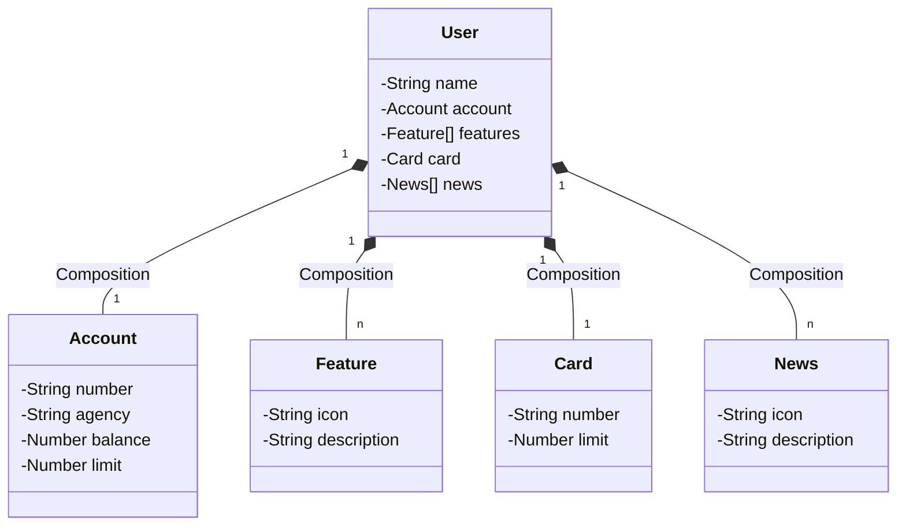

# Santander Bootcamp 2023
Java RESTful API created for Santander Bootcamp 2023

# Class Diagram

```mermaid
classDiagram
    class User {
        -String name
        -Account account
        -Feature[] features
        -Card card
        -News[] news
    }
    
    class Account {
        -String number
        -String agency
        -Number balance
        -Number limit
    }
    
    class Feature {
        -String icon
        -String description
    }
    
    class Card {
        -String number
        -Number limit
    }
    
    class News {
        -String icon
        -String description
    }
    
    User "1" *-- "1" Account : Composition
    User "1" *-- "n" Feature : Composition
    User "1" *-- "1" Card : Composition
    User "1" *-- "n" News : Composition
```